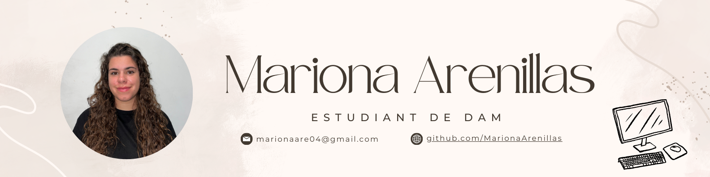

# Hola, sóc la Mariona Arenillas 👋

### 🌐 Tria idioma / Choose your language  
 
 

---

### 👩‍💻 Sobre mi

Estic cursant el cicle formatiu de **Desenvolupament d'Aplicacions Multiplataforma** (DAM) a **La Salle Gràcia**.  
Em motiva crear aplicacions útils i aprendre contínuament noves tecnologies. M’encanta programar i experimentar amb projectes que m’ajudin a créixer professionalment.

---

### 🎯 Interessos i Objectius

---

### 🚀 Tecnologies i eines 

 

---

### 📊 Estadístiques

<!-- GITHUB STATS -->
<picture>
  <source
    srcset="https://github-readme-stats.vercel.app/api?username=MarionaArenillas&show_icons=true&bg_color=161b22&border_color=22222288&text_color=bbb"
    media="(prefers-color-scheme: dark)"
  />
  <source
    srcset="https://github-readme-stats.vercel.app/api?username=MarionaArenillas&show_icons=true&bg_color=00000000&border_color=22222288&text_color=222"
    media="(prefers-color-scheme: light), (prefers-color-scheme: no-preference)"
  />
  
</picture>

<!-- TOP LANGS -->
<picture>
  <source
    srcset="https://github-readme-stats.vercel.app/api/top-langs/?username=MarionaArenillas&layout=compact&bg_color=161b22&border_color=22222288&text_color=bbb"
    media="(prefers-color-scheme: dark)"
  />
  <source
    srcset="https://github-readme-stats.vercel.app/api/top-langs/?username=MarionaArenillas&layout=compact&bg_color=00000000&border_color=22222288&text_color=222"
    media="(prefers-color-scheme: light), (prefers-color-scheme: no-preference)"
  />
  
</picture>

---

### 💬 Contacta amb mi

- **📧 Correu de l’escola:** [mariona.arenillas@gracia.lasalle.cat](mailto:mariona.arenillas@gracia.lasalle.cat)  
- **📫 Correu personal:** [marionaare04@gmail.com](mailto:marionaare04@gmail.com)   

---

**Gràcies per visitar el meu perfil! 👾** 

